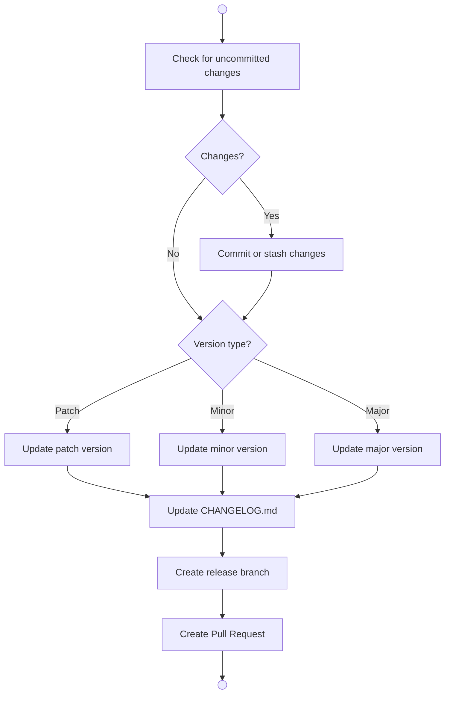

# Release Process

Follow this structured workflow to create a new release.

## Flow

## Node Details

### Check for uncommitted changes
Run `git status` and check if there are any uncommitted changes.

### Commit or stash changes
Ask the user whether to commit the changes or stash them for later.

### Version type
Ask the user what type of release this is:
- **Patch**: Bug fixes (0.0.X)
- **Minor**: New features, backward compatible (0.X.0)
- **Major**: Breaking changes (X.0.0)

### Update version
Update the version number in:
- `pyproject.toml` or `package.json`
- Any other version files

### Update CHANGELOG
Add a new section to CHANGELOG.md with:
- Version number and date
- List of changes
- Breaking changes (if any)
- Migration notes (if needed)

### Create release branch
Create a new branch: `release/vX.Y.Z`

### Create Pull Request
Open a PR with:
- Title: "Release vX.Y.Z"
- Description summarizing the changes
