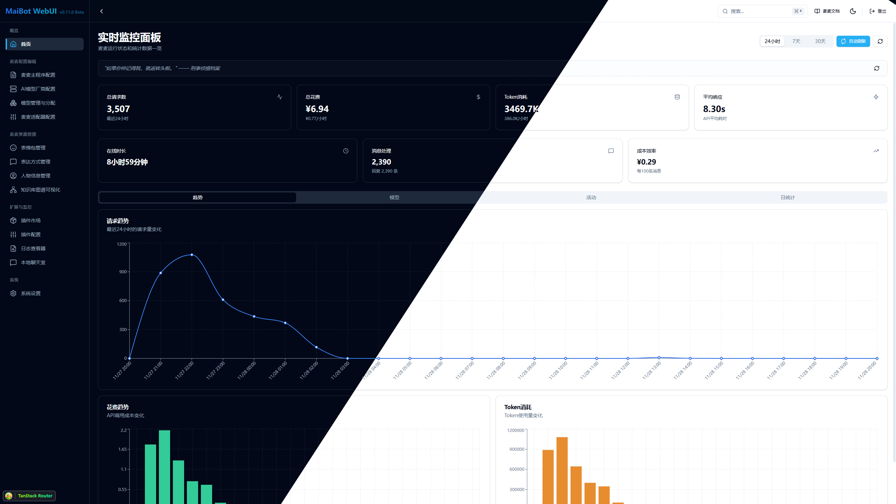

# MaiBot Dashboard

> MaiBot 的现代化 Web 管理面板 - 基于 React 19 + TypeScript + Vite 构建

<div align="center">

[](https://react.dev/)
[](https://www.typescriptlang.org/)
[](https://vitejs.dev/)
[](https://tailwindcss.com/)

</div>

## 📖 项目简介

MaiBot Dashboard 是 MaiBot 聊天机器人的 Web 管理界面，提供了直观的配置管理、实时监控、插件管理、资源管理等功能。通过自动解析后端配置类，动态生成表单，实现了配置的可视化编辑。

<div align="center">
  
</div>

### ✨ 核心特性

- 🎨 **现代化 UI** - 基于 shadcn/ui 组件库，支持亮色/暗色主题切换
- ⚡ **高性能** - 使用 Vite 7.2 构建，React 19 最新特性
- 🔐 **安全认证** - Token 认证机制，支持自定义和自动生成 Token
- 📝 **智能配置** - 自动解析 Python dataclass，生成配置表单
- 🎯 **类型安全** - 完整的 TypeScript 类型定义
- 🔄 **实时更新** - WebSocket 实时日志流、配置自动保存
- 📱 **响应式设计** - 完美适配桌面和移动设备
- 💬 **本地对话** - 直接在 WebUI 与麦麦对话，无需外部平台

## 🎯 功能模块

### 📊 仪表盘（首页）
- **实时统计** - 总请求数、Token 消耗、费用统计、在线时长
- **模型统计** - 各模型的使用次数、费用、平均响应时间
- **趋势图表** - 每小时请求量、Token 消耗、费用趋势折线图
- **模型分布** - 饼图展示模型使用占比
- **最近活动** - 实时刷新的请求活动列表

### 💬 本地聊天室
- **WebSocket 实时通信** - 与麦麦直接对话
- **消息历史** - 自动加载 SQLite 存储的历史消息
- **连接状态** - 实时显示 WebSocket 连接状态
- **自定义昵称** - 可自定义用户身份
- **移动端适配** - 完整的响应式聊天界面

### ⚙️ 配置管理

#### 麦麦主程序配置
- **分组展示** - 配置项按功能分组（基础设置、功能开关等）
- **智能表单** - 根据配置类型自动生成对应控件
- **自动保存** - 2秒防抖自动保存，无需手动操作
- **一键重启** - 保存并重启麦麦，使配置生效

#### AI 模型厂商配置
- **提供商管理** - 添加、编辑、删除 API 提供商
- **模板选择** - 预设常用厂商模板（OpenAI、DeepSeek、硅基流动等）
- **连接测试** - ⚡ 测试提供商连接状态和 API Key 有效性
- **批量操作** - 批量删除、批量测试所有提供商
- **搜索过滤** - 按名称、URL、类型快速筛选

#### 模型管理与分配
- **模型列表** - 管理可用的模型配置
- **使用状态** - 显示模型是否被任务使用
- **任务分配** - 为不同功能分配模型（回复、工具调用、VLM 等）
- **参数调整** - 温度、最大 Token 等参数配置
- **新手引导** - 交互式引导教程

#### 适配器配置
- **NapCat 配置** - 管理 QQ 机器人适配器
- **Docker 支持** - 支持容器模式配置
- **配置导入导出** - 跨环境迁移配置

### 📋 实时日志
- **WebSocket 流式传输** - 实时接收后端日志
- **虚拟滚动** - 高性能处理大量日志
- **多级过滤** - 按日志级别（DEBUG/INFO/WARNING/ERROR）过滤
- **模块过滤** - 按日志来源模块筛选
- **时间范围** - 日期选择器筛选日志
- **搜索高亮** - 关键字搜索并高亮显示
- **字号调整** - 自定义日志显示字号和行间距
- **日志导出** - 导出过滤后的日志

### 🔌 插件管理
- **插件市场** - 浏览和搜索可用插件
- **分类筛选** - 按类别、状态筛选插件
- **一键安装** - 自动处理依赖并安装插件
- **版本兼容** - 检查插件与 MaiBot 版本兼容性
- **进度显示** - WebSocket 实时显示安装进度
- **插件统计** - 下载量、更新时间等信息
- **卸载更新** - 管理已安装插件

### 👤 人物关系管理
- **人物列表** - 查看所有已知用户信息
- **详情编辑** - 编辑用户昵称、备注等信息
- **关系统计** - 查看消息数、互动频率等统计
- **批量操作** - 批量删除用户记录

### 📦 资源管理

#### 表情包管理
- **预览管理** - 图片/GIF 预览
- **分类过滤** - 按注册状态、描述筛选
- **编辑标签** - 修改表情包描述和属性
- **批量禁用** - 启用/禁用表情包

#### 表达方式管理
- **表达列表** - 查看麦麦学习的表达方式
- **来源追踪** - 记录表达来源群组和用户
- **编辑创建** - 手动添加或编辑表达

#### 知识图谱
- **可视化展示** - ReactFlow 交互式图谱
- **节点搜索** - 搜索实体和关系
- **布局算法** - 自动布局优化
- **详情查看** - 点击节点查看详细信息

### ⚙️ 系统设置
- **主题切换** - 亮色/暗色/跟随系统
- **动画控制** - 开启/关闭界面动画
- **Token 管理** - 查看、复制、重新生成认证 Token
- **版本信息** - 查看前端和后端版本

## 🏗️ 技术架构

### 前端技术栈

```
React 19.2.0          # UI 框架
├── TypeScript 5.9    # 类型系统
├── Vite 7.2          # 构建工具
├── TanStack Router   # 路由管理
├── TanStack Virtual  # 虚拟滚动
├── Jotai             # 状态管理
├── Tailwind CSS 4.2  # 样式框架
├── ReactFlow         # 知识图谱可视化
├── Recharts          # 数据图表
└── shadcn/ui         # 组件库
    ├── Radix UI      # 无障碍组件
    └── lucide-react  # 图标库
```

### 后端集成

```
FastAPI               # Python 后端框架
├── WebSocket         # 实时日志、聊天
├── config_schema.py  # 配置架构生成器
├── config_routes.py  # 配置管理 API
├── model_routes.py   # 模型管理 API
├── chat_routes.py    # 本地聊天 API
├── plugin_routes.py  # 插件管理 API
├── person_routes.py  # 人物管理 API
├── emoji_routes.py   # 表情包管理 API
├── expression_routes.py  # 表达管理 API
├── knowledge_routes.py   # 知识图谱 API
├── logs_routes.py    # 日志 API
└── tomlkit           # TOML 文件处理
```

## 📁 项目结构

```
MaiBot-Dashboard/
├── src/
│   ├── components/          # 组件目录
│   │   ├── ui/             # shadcn/ui 组件
│   │   ├── layout.tsx      # 布局组件（侧边栏+导航）
│   │   ├── tour/           # 新手引导组件
│   │   ├── plugin-stats.tsx    # 插件统计组件
│   │   ├── RestartingOverlay.tsx  # 重启遮罩
│   │   └── use-theme.tsx   # 主题管理
│   ├── routes/             # 路由页面
│   │   ├── index.tsx       # 仪表盘首页
│   │   ├── auth.tsx        # 登录页
│   │   ├── chat.tsx        # 本地聊天室
│   │   ├── logs.tsx        # 日志查看
│   │   ├── plugins.tsx     # 插件管理
│   │   ├── person.tsx      # 人物管理
│   │   ├── settings.tsx    # 系统设置
│   │   ├── config/         # 配置管理页面
│   │   │   ├── bot.tsx         # 麦麦主程序配置
│   │   │   ├── modelProvider.tsx  # 模型提供商
│   │   │   ├── model.tsx       # 模型管理
│   │   │   └── adapter.tsx     # 适配器配置
│   │   └── resource/       # 资源管理页面
│   │       ├── emoji.tsx       # 表情包管理
│   │       ├── expression.tsx  # 表达方式管理
│   │       └── knowledge-graph.tsx  # 知识图谱
│   ├── lib/                # 工具库
│   │   ├── config-api.ts   # 配置 API 客户端
│   │   ├── plugin-api.ts   # 插件 API 客户端
│   │   ├── person-api.ts   # 人物 API 客户端
│   │   ├── expression-api.ts   # 表达 API 客户端
│   │   ├── log-websocket.ts    # 日志 WebSocket
│   │   ├── fetch-with-auth.ts  # 认证请求封装
│   │   └── utils.ts        # 通用工具函数
│   ├── types/              # 类型定义
│   │   ├── config-schema.ts    # 配置架构类型
│   │   ├── plugin.ts       # 插件类型
│   │   ├── person.ts       # 人物类型
│   │   └── expression.ts   # 表达类型
│   ├── hooks/              # React Hooks
│   │   ├── use-auth.ts     # 认证逻辑
│   │   ├── use-animation.ts    # 动画控制
│   │   └── use-toast.ts    # 消息提示
│   ├── store/              # 全局状态
│   │   └── auth.ts         # 认证状态
│   ├── router.tsx          # 路由配置
│   ├── main.tsx            # 应用入口
│   └── index.css           # 全局样式
├── public/                 # 静态资源
├── vite.config.ts          # Vite 配置
├── tailwind.config.js      # Tailwind v4 兼容占位配置
├── tsconfig.json           # TypeScript 配置
└── package.json            # 依赖管理
```

## 🚀 快速开始

### 环境要求

- Node.js >= 18.0.0
- Bun >= 1.0.0 (推荐) 或 npm/yarn/pnpm

### 安装依赖

```bash
# 使用 Bun（推荐）
bun install

# 或使用 npm
npm install
```

### 开发模式

```bash
# 启动开发服务器 (默认端口: 7999)
bun run dev

# 或
npm run dev
```

访问 http://localhost:7999 查看应用。

### 生产构建

```bash
# 构建生产版本
bun run build

# 预览生产构建
bun run preview
```

构建产物会输出到 `dist/` 目录，由 MaiBot 后端静态服务。

### 代码格式化

```bash
# 格式化代码
bun run format
```

## 🔧 开发配置

### Vite 代理配置

开发模式下，Vite 会将 API 请求代理到后端：

```typescript
// vite.config.ts
proxy: {
  '/api': {
    target: 'http://127.0.0.1:8001',
    changeOrigin: true,
    ws: true,  // WebSocket 支持
  },
},
```

### 环境变量

开发环境默认使用 `http://localhost:7999`，生产环境使用相对路径。

## 📸 界面预览

### 仪表盘
实时统计、模型使用分布、趋势图表

### 本地聊天
直接与麦麦对话，消息实时同步

### 配置管理
分组配置项，自动生成表单，自动保存

### 模型提供商
一键测试连接状态，模板快速添加

### 日志查看
实时日志流，多级过滤，虚拟滚动

## 📦 依赖说明

### 核心依赖

| 包名 | 版本 | 用途 |
|------|------|------|
| react | ^19.2.0 | UI 框架 |
| react-dom | ^19.2.0 | React DOM 渲染 |
| typescript | ~5.9.3 | 类型系统 |
| vite | ^7.2.2 | 构建工具 |
| @tanstack/react-router | ^1.136.1 | 路由管理 |
| @tanstack/react-virtual | ^3.x | 虚拟滚动 |
| jotai | ^2.15.1 | 状态管理 |
| axios | ^1.13.2 | HTTP 客户端 |
| recharts | ^2.x | 数据图表 |
| reactflow | ^11.x | 知识图谱可视化 |
| dagre | ^0.8.x | 图布局算法 |

### UI 组件库

| 包名 | 版本 | 用途 |
|------|------|------|
| @radix-ui/react-* | ^1.x | 无障碍组件基础 |
| lucide-react | ^0.553.0 | 图标库 |
| tailwindcss | ^4.2.1 | CSS 框架 |
| class-variance-authority | ^0.7.1 | 类名管理 |
| tailwind-merge | ^3.4.0 | Tailwind 类合并 |
| date-fns | ^3.x | 日期处理 |


## 🤝 贡献指南

1. Fork 本仓库
2. 创建特性分支 (`git checkout -b feature/AmazingFeature`)
3. 提交更改 (`git commit -m 'Add some AmazingFeature'`)
4. 推送到分支 (`git push origin feature/AmazingFeature`)
5. 开启 Pull Request

### 代码规范

- 使用 TypeScript 严格模式
- 遵循 ESLint 规则
- 使用 Prettier 格式化代码
- 组件使用函数式编写
- 优先使用 Hooks
- 响应式设计优先（移动端适配）

## 📄 开源协议

本项目基于 GPLv3 协议开源，详见 [LICENSE](./LICENSE) 文件。

## 👥 作者

**MotricSeven** - [GitHub](https://github.com/DrSmoothl)

## 🙏 致谢

- [React](https://react.dev/) - UI 框架
- [shadcn/ui](https://ui.shadcn.com/) - 组件库
- [Radix UI](https://www.radix-ui.com/) - 无障碍组件
- [TanStack Router](https://tanstack.com/router) - 路由解决方案
- [TanStack Virtual](https://tanstack.com/virtual) - 虚拟滚动
- [Tailwind CSS](https://tailwindcss.com/) - CSS 框架
- [ReactFlow](https://reactflow.dev/) - 流程图/知识图谱
- [Recharts](https://recharts.org/) - React 图表库

---

<div align="center">
Made with ❤️ by MotricSeven and Mai-with-u
</div>
